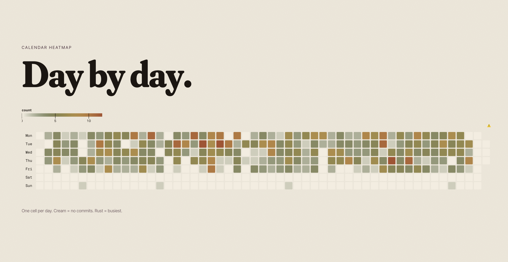

# Almanac

Spotify Wrapped for your codebase.

Pick a repo and a time range. Get commit velocity, code churn, hottest files, language breakdown, and author stats — as JSON, a TTY slideshow, or a self-contained HTML report.



## Usage

```bash
almanac                          # current repo, last 12 months (TTY if interactive)
almanac --year 2025
almanac --since 2025-01-01 --until 2025-06-30
almanac --repo ~/dev/my-project
almanac --author alice@example.com
almanac --json                   # full stats bundle on stdout
almanac --html                   # temp HTML report, opened in browser
almanac --html-out report.html   # write HTML, no browser
```

## Flags

| Flag | Description |
|---|---|
| `--repo PATH` | Repo path (default: cwd) |
| `--year INT` | Calendar-year window. Mutually exclusive with `--since` / `--until`. |
| `--since YYYY-MM-DD` / `--until YYYY-MM-DD` | Window bounds. Bare dates are start-of-day / end-of-day in the author-local frame — `--until 2026-04-18` **includes** that day. |
| `--author TEXT` | Case-insensitive name or email match |
| `--include-merges` | Include merge commits in bundle metrics |
| `--json` | Emit full stats bundle to stdout |
| `--tty` / `--no-tty` | Force the TTY slideshow or the one-line summary |
| `--html` / `--html-out PATH` | Render the HTML report (opens in browser, or writes to `PATH`) |
| `--gravatar` | Opt into Gravatar avatars (emits `md5(email)` to gravatar.com when opened) |
| `--classifier {auto,rules,zeroshot}` | Commit-subject classifier (default `auto`) |

Stub flags (`--theme`, `--png`, `--demo`, `--voice`, `--soundtrack`, `--slides`) print `not yet implemented` and exit 1.

Run `almanac --json | jq` to see the full `schema_version: 1` bundle shape.

## Install

```bash
uv pip install -e .           # click only, no model downloads
uv pip install -e '.[ml]'     # + torch/transformers for --classifier zeroshot
```

Python 3.11+. The zero-shot model (~180MB DeBERTa) downloads to the Hugging Face cache on first use (`HF_HOME` to override).

## How it works

Single `git log --numstat -z` subprocess; stats computed in memory. TTY and HTML renderers share the JSON bundle and are independent of ingest.

Windows are **author-local** (commit `%aI` wall-clock) — heatmaps and hour-of-day slides match what you see in your own log. Non-UTF-8 bytes in commits or paths decode with replacement characters; hostile repos can't crash the run.

Commit subjects are classified into Conventional Commits verbs (`feat`, `fix`, `chore`, …) plus `unclear`, through a layered pipeline: preprocessing (strips PR/ticket/branch noise) → CC regex → first-verb rules → Renovate/Dependabot patterns → optional zero-shot DeBERTa. The model collapses to `unclear` below 0.35 confidence or a 0.05 top-two margin.
