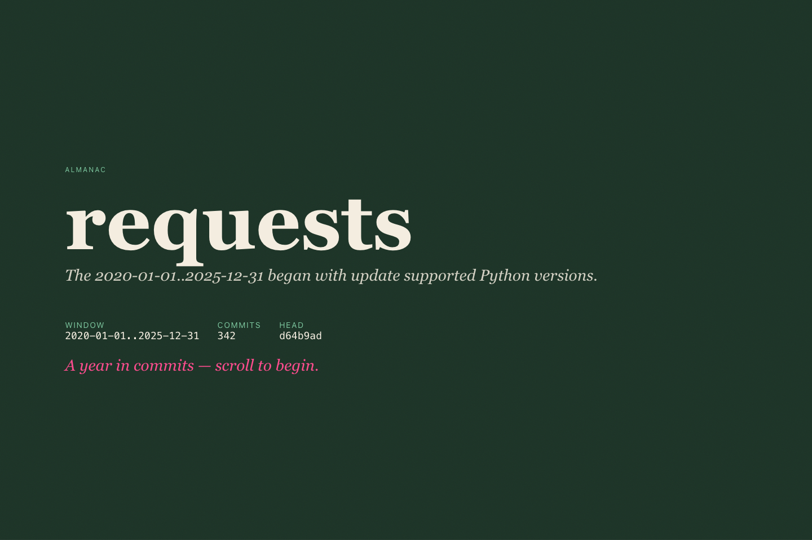
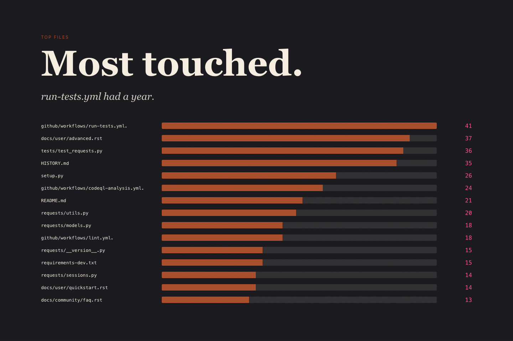

# Almanac

A year-in-review for a git repo — "Spotify Wrapped for your codebase." Point it at a repo and a time range; it reads `git log` and reports commit cadence, line churn, the files that changed most, language mix, and per-author breakdowns.

Output is one of: a self-contained HTML report, the raw JSON bundle, an animated TTY slideshow, or a one-line summary.





The screenshots above were generated from the public [`psf/requests`](https://github.com/psf/requests) repository over a 2020-2025 window.

## Quickstart

Install from a checkout:

```bash
uv pip install -e .
```

Run a tiny demo that does not read git history:

```bash
almanac --demo --html-out demo.html
```

Open `demo.html` in a browser. It is a self-contained report built from
deterministic synthetic data.

## Usage

The HTML report is the main output — a single file with no outbound requests.

```bash
almanac --html                   # render and open in browser
almanac --html-out report.html   # write HTML to path, no browser
```

Other modes:

```bash
almanac                          # quick TTY slideshow if interactive, one-liner otherwise
almanac --json                   # full stats bundle on stdout
almanac --year 2025
almanac --since 2025-01-01 --until 2025-06-30
almanac --repo ~/dev/my-project
almanac --author alice@example.com
```

To reproduce the README screenshots:

```bash
git clone https://github.com/psf/requests.git /tmp/requests
almanac \
  --repo /tmp/requests \
  --since 2020-01-01 \
  --until 2025-12-31 \
  --theme wrapped \
  --html-out /tmp/almanac-requests-2020-2025.html
```

## Flags

| Flag | Description |
|---|---|
| `--repo PATH` | Repo path (default: cwd) |
| `--year INT` | Calendar-year window. Mutually exclusive with `--since` / `--until`. |
| `--since YYYY-MM-DD` / `--until YYYY-MM-DD` | Window bounds. Bare dates are start-of-day / end-of-day in the author-local frame; `--until 2026-04-18` **includes** that day. |
| `--author TEXT` | Case-insensitive name or email match |
| `--include-merges` | Include merge commits in bundle metrics |
| `--json` | Emit full stats bundle to stdout |
| `--tty` / `--no-tty` | Force the TTY slideshow or the one-line summary |
| `--html` / `--html-out PATH` | Render the HTML report (opens in browser, or writes to `PATH`) |
| `--theme {classic,terminal,midnight,paper,wrapped}` | Theme for HTML output |
| `--png` / `--png-out PATH` | Render a 1200x630 PNG share card (requires `almanac[png]` and Chromium) |
| `--demo` | Render a deterministic synthetic report without reading git |
| `--gravatar` | Opt into Gravatar avatars (emits `md5(email)` to gravatar.com when opened) |
| `--classifier {auto,rules,zeroshot}` | Commit-subject classifier (default `auto`) |

Stub flags (`--voice`, `--soundtrack`, `--slides`) print `not yet implemented` and exit 1.

Run `almanac --json | jq` to see the full `schema_version: 1` bundle shape.

## Install

```bash
uv pip install -e .           # click only, no model downloads
uv pip install -e '.[ml]'     # + torch/transformers for --classifier zeroshot
uv pip install -e '.[png]'    # + playwright for --png
playwright install chromium   # one-time browser install for --png
```

Python 3.11+. The base install uses Click only and downloads no models. The
zero-shot model (~180MB DeBERTa) downloads to the Hugging Face cache on first
use (`HF_HOME` to override).

## How it works

Single `git log --numstat -z` subprocess; stats computed in memory. TTY and HTML renderers share the JSON bundle and are independent of ingest.

Windows are **author-local** (commit `%aI` wall-clock), so heatmaps and hour-of-day slides match what you see in your own log. Non-UTF-8 bytes in commits or paths decode with replacement characters; hostile repos can't crash the run.

Commit subjects are classified into Conventional Commits verbs (`feat`, `fix`, `chore`, …) plus `unclear`, through a layered pipeline: preprocessing (strips PR/ticket/branch noise) → CC regex → first-verb rules → Renovate/Dependabot patterns → optional zero-shot DeBERTa. The model collapses to `unclear` below 0.35 confidence or a 0.05 top-two margin.

## Development

```bash
uv sync --dev
uv run pre-commit install
make check
```
